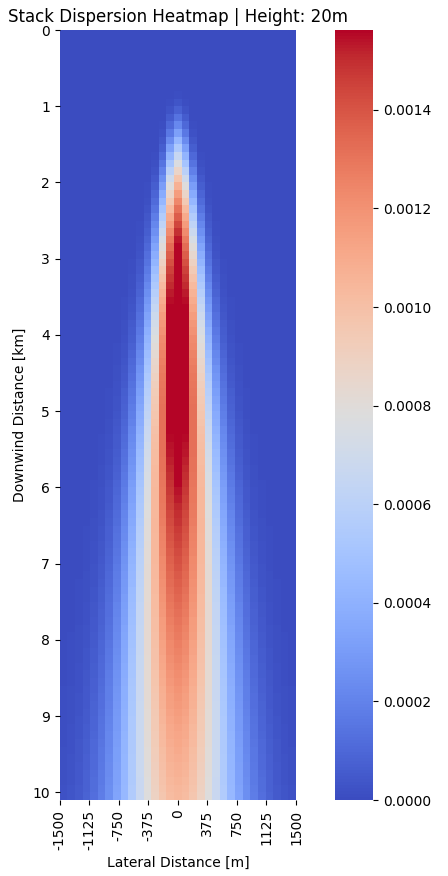

#### Table of Contents
- [Tall Stack Dispersion Modelling with Python](#tall-stack-dispersion-modelling-with-python)
  - [Clone the repository from the terminal](#clone-the-repository-from-the-terminal)
  - [Python 3](#python-3)
  - [Required Libraries](#required-libraries)
  - [Running the Program](#running-the-program)
  - [Important Notes](#important-notes)
- [Tall Stack Dispersion Interactive Model](#tall-stack-dispersion-interactive-model)
  - [Jupyter Notebook](#jupyter-notebook)
  - [Example Plot](#example-plot)

# Tall Stack Dispersion Modelling with Python
## Clone the repository from the terminal

```bash
git clone https://github.com/WhittleGuy/stack-dispersion/
```

Given it is only one file, it would also be trivial to copy the raw code and paste it into your own `dispersion_full.py` file on your pc.

## Python 3

The Python 3 installer is available [here](https://www.python.org/downloads/). This program was written using Python version 3.9.5.

## Required Libraries

- numpy
- pandas
- matplotlib
- seaborn

Install the required libraries from the terminal:

```bash
pip install numpy pandas matplotlib seaborn
```

## Running the Program

To run the program, use the following bash command:

```bash
python dispersion_full.py
```

The following should appear on your screen:

```
*******************************************************
Atmospheric Dispersion Model
Written by Brandon Whittle
*******************************************************
Use static values [0/1]:
```

The "static values" it is referenceing are default values built into the program for testing purposes. Type `0` to use your own data.

The next prompt:

```
Run a single calculation [0/1]:
```

is asking if you want the concentration for a single point (`1`) or if you want to calculate concentrations for a bounded volume (`0`). **Note**: Calculating the concentration at a single point will ask for all of the same data as the bounded volume calculation, but will return only the resulting value at that point. No tables, no plots. Simple.

Next, you will have to categorize the atmospheric conditions around the stack. I have provided the same table used in the textbook and Environmental Protection Agency booklet.

```
-------------------------------------------------------
                Atmospheric Conditions
-------------------------------------------------------
                Day                  | Night
  Wind [m/s] Strong Moderate Slight  |   Low Moderate
0         <2      A      A-B      B  |
1        2-3    A-B        B      C  |     E        F
2        3-5      B      B-C      C  |     D        E
3        5-6      C      C-D      D  |     D        D
4         >6      C        D      D  |     D        D
-------------------------------------------------------
*Wind speed is at a height of 10m
*Day is an estimation of solar radiation
*Night is an estimation of cloud cover
*Category 'D' can be assumed for all overcast
        conditions, regardless of wind speed
-------------------------------------------------------
Select the appropriate category:
```

Respond to this question with the _capital_ letter that matches your data. If your data points to one of the categories with two letters (i.e. `A-B`), do not type both. This signifies an in between point, and either one could be valid. Pick one, and you can always come back later and choose the other.

Continue entering data for your scenario. The code has annotations by the variables if you aren't quite sure what it is asking for. Below, I have included an example from a textbook:

```
Downwind distance [km]: 3
Lateral distance [m]: 0
Vertical distance [m]: 0
Stack height [m]: 120.0
Stack diameter [m]: 1.2
Ambient air pressure [kPa]: 95.0
Wind speed [m/s]: 4.5
Ambient air temperature [K]: 298.15
Stack temperature [K]: 588.15
Stack emission rate [g/s]: 1656.2
Stack velocity [m/s]: 10.0
```

(This should give you an answer of ~0.001455.)

You will then be prompted with several options:

- Print results.
  - Prints result table to your terminal.
  - If the table is large, they will be clipped.
- Save
  - Exports result table as a .csv file in the same directory the program file is in.
- Show heatmap
  - Display a heatmap of concentrations at a particular height above the ground

If you decide to view the heatmap, you will be prompted for the height. Concentrations are stored in several planes corresponding to different heights. The prompt will list your options. These plots can give you a general idea of the dispersion's "shape" on that elevation plane.

## Important Notes

- When calculating a single point, the value returned will be the concentration at the data you entered
- When calculating concentrations in a volume, the data will be _bounded_ by the downwind, lateral, and vertical values you enter. The values are inclusive.
- Generating a dataset is not always immediate. Large tables may take several seconds, maybe minutes, to generate, depending on the volume of the bounded area, and your pc specifications.

# Tall Stack Dispersion Interactive Model
## Jupyter Notebook

Jupyter Notebook is available [here](https://jupyter.org/). It is widely used for practicing and using python, and is great for everything from simple addition to designing machine learning algorithms.

The Jupyter Notebook file is an interactive model with sliders for the variables, and a quickly updating plot. It utilizes `ipywidgets`, in addition to the libraries in the main python program.

Include the following to enable `ipywidgets`:

```bash
pip install ipywidgets
jupyter nbextension enable --py widgetnbextension
```

## Example Plot


